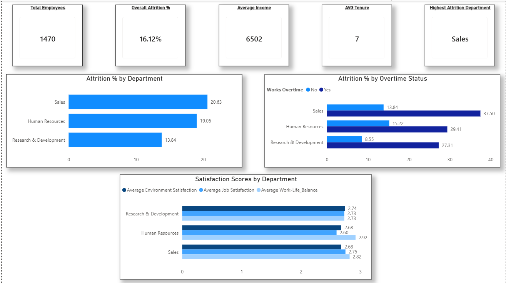
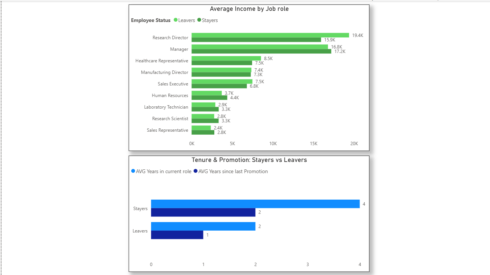

# HR Analytics — Employee Attrition & Performance

## Project Overview
This project analyses employee attrition and performance data using SQL (T-SQL) and Power BI.
The goal is to help HR managers understand who is leaving, why, and where to focus retention efforts.

**Dataset:** IBM HR Analytics Employee Attrition & Performance (Kaggle)  
**Tools:** SQL Server Management Studio (SSMS), Power BI Desktop  
**Techniques:** CASE WHEN, GROUP BY aggregations, scalar subqueries, CAST, window functions

---

## Business Questions
1. Which departments have the highest attrition rate?
2. Do employees who leave earn less than those who stay?
3. Does working overtime increase the likelihood of leaving?
4. How do satisfaction scores compare across departments?
5. How does tenure and promotion history differ between leavers and stayers?
6. What does the overall HR summary look like at company level?

---

## SQL Queries & Findings

### Query 1 — Attrition Rate by Department
Sales has the highest attrition at 20.63%, followed by Human Resources at 19.05%.
Research & Development is significantly lower at 13.84%.

### Query 2 — Average Income by Job Role (Leavers vs Stayers)
In most roles, employees who left earned less than those who stayed.
Research Director is a notable exception — leavers earned more (19,395) than stayers (15,947),
suggesting non-financial reasons for leaving. Sales Representatives show the lowest
income overall, compounding the high attrition rate from Query 1.

### Query 3 — Overtime & Attrition by Department
Overtime roughly doubles attrition in HR and R&D. In Sales, overtime employees
leave at 37.50% — nearly 3x the non-overtime rate of 13.84%. R&D without overtime
is healthy at 8.55%, suggesting overtime, not the department, is the retention risk.

### Query 4 — Satisfaction Scores by Department
All departments score between 2.60 and 2.92 out of 4, indicating below-average
satisfaction company-wide. Human Resources has the lowest Job Satisfaction at 2.60.
Sales consistently underperforms across all three satisfaction metrics.

### Query 5 — Tenure & Promotion Analysis
Leavers spent on average only 2 years in their current role, half that of stayers at 4 years.
Interestingly, leavers were promoted more recently than stayers, suggesting promotion
alone does not prevent attrition.

### Query 6 — Executive HR Summary
| Metric | Value |
|---|---|
| Total Employees | 1,470 |
| Overall Attrition Rate | 16.12% |
| Average Monthly Income | $6,502 |
| Average Tenure | 7 years |
| Highest Attrition Department | Sales |

---

## SQL Techniques Used
| Technique | Query |
|---|---|
| CASE WHEN | Q2, Q3, Q5 |
| GROUP BY Aggregations | Q1, Q2, Q3, Q4 |
| CAST for Decimal Precision | Q1, Q3, Q4, Q6 |
| Multiple AVG Aggregations | Q4 |
| Scalar Subqueries | Q6 |
| TOP 1 with ORDER BY | Q6 |

---

## Power BI Dashboard

### Page 1 — Attrition Overview

### Page 2 — Income & Tenure Detail

---

## Key Business Insights
- **Sales is the highest risk department** — highest attrition rate (20.63%) and lowest satisfaction scores
- **Overtime is a major attrition driver** — attrition nearly doubles or triples for overtime workers across all departments
- **Income matters but isn't everything** — Research Directors left despite earning more, pointing to non-financial factors
- **Promotion doesn't guarantee retention** — leavers were promoted more recently than stayers
- **Company-wide satisfaction is below average** — all scores below 3 out of 4 suggest systemic culture issues

---

## Related Projects
- [Project 1 — DataCo Supply Chain Analysis](https://github.com/jurgensp09-ship-it)
- [Project 2 — Sales & Employee Performance Analysis](https://github.com/jurgensp09-ship-it/Sales-Employee-Performance-SQL-PowerBI)
